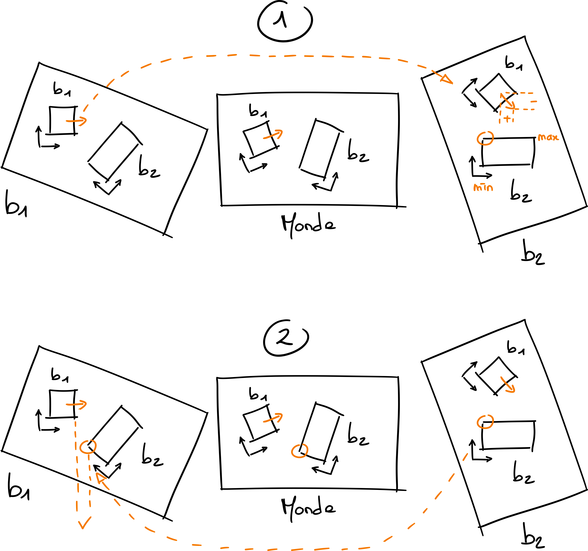

# Intersection de boîtes englobantes

Le but de ce TP est le calcul d'intersections de boîtes englobantes.

## Mise en place

### Mise à jour de gKit

N'oubliez pas avant de commencer de mettre à jour gKit. Il est possible que des
fonctionnalités aient été ajoutées pour vous faciliter la vie.

Si vous ne versionnez pas vos propres ajouts, vous devriez le faire, mais en attendant vous pouvez mettre à jour via un simple `git pull`.

Si vous versionnez vos ajouts, le plus simple est de faire un commit de vos
ajouts, puis de tenter de rejouer vos commits depuis la nouvelle version de
gKit.

```
git pull --rebase
```

Si vous avez créé votre propre fork de gKit, vous pouvez récupérer les nouvelles
versions en ajoutant le dépôt initial comme nouveau dépôt distant en plus de
votre fork.

```
git remote add upstream https://forge.univ-lyon1.fr/Alexandre.Meyer/gkit2light.git
git pull --rebase upstream master
```

remplacez `master` par le nom de la branche que vous souhaitez suivre.

### Récupération des sources

Allez dans le répertoire de gKit et clonez ce dépôt

```
git clone https://forge.univ-lyon1.fr/m1if27/box-intersection-etu.git
```

Éditez ensuite le fichier `premake4.lua` de la racine de gKit, et ajoutez à la
fin la ligne

```
include "box-intersection-etu"
```

Lancez enfin la création des Makefile ou des fichiers projets de votre choix.

```
premake4 gmake
```

Vous pouvez désormais compiler le projet `box_intersect`.

## Boîte englobante alignée sur les axes

[[Démo du résultat attendu]](https://perso.liris.cnrs.fr/vincent.nivoliers/mif27/box_intersection/box_intersect_translation/)

### Principe

Une boîte englobante alignée sur les axes (AABB : axis aligned bounding box) est
une boîte qui décrit pour chaque axe (x, y, z) l'étendue de l'objet qu'elle
contient. Par exemple, la boîte englobante d'une sphère centrée sur l'origine de
rayon 1 indiquera que cette sphère se situe entre x = -1 et x = 1, entre y = -1
et y = 1, et entre z = -1 et z = 1.

Pour déterminer la boîte englobante alignée sur les axes d'un objet, il suffit
donc de déterminer sur chaque axe le minimum et le maximum des points de
l'objet.


### Code fourni

Dans le code fourni, une boîte englobante est décrite via deux points : un point
`pmin` dont les coordonnées sont les minima selon tous les axes et un point
`pmax` dont les coordonnées sont les maxima selon tous les axes. Dans l'exemple
de la sphère ci-dessus, nous aurions donc `pmin` de coordonnées (-1, -1, -1) et
`pmax` de coordonnées (1, 1, 1).

Il est également ajouté une transformation `T`, qui permet de placer la boîte.
Elle permet donc éventuellement à la boîte de suivre les transformation de
l'objet qu'elle contient en appliquant `T` à `pmin` et `pmax`. Dans un premier
temps, seules les translations sont à gérer.

## Intersection

Lorsque les boîtes n'ont subi qu'une translation, il est facile de tester si
deux boîtes s'intersectent en comparant simplement leurs bornes. Sur le schéma
suivant, déterminez les bornes `pmin` et `pmax` de l'intersection des deux
boîtes en fonction des bornes de deux boîtes. Déduisez en dans quel cas cette
intersectin est vide.


## Généralisation aux boîtes non alignées

[[Démo du résultat attendu]](https://perso.liris.cnrs.fr/vincent.nivoliers/mif27/box_intersection/box_intersect_full/)

Le problème est plus complexe lorsque la transformation des deux boîtes n'est
pas qu'une translation. Dans ce cas, l'intersection des deux boîtes n'est plus
elle-même une boîte et le test précédent ne fonctionne plus. Vous pouvez
désormais décommenter dans `main.cpp` les deux lignes compliquant la
transformation pour vous attaquer à ce problème.

### Principe

Un plan séparateur entre deux objets est un plan tel que le premier objet est
d'un côté et le second de l'autre. Il est possible de montrer que dans le cas de
deux boîtes, si les boîtes ne s'intersectent pas, alors une face d'une des deux
boîtes est un plan séparateur. Nous allons donc tester pour chaque face de
chaque boîte si l'autre boîte est entièrement de l'autre côté de cette face.

### Changements de repère

Pour tester si un point est d'un côté ou de l'autre d'une face d'une boîte `b1`,
il est plus simple de travailler dans le repère de cette boîte : dans ce repère
les faces de la boîte sont alignées sur les axes. Il suffit donc de comparer la
coordonnées du point le long de l'axe de la face à la borne correspondand à
cette face pour la boîte. Par exemple, dans le cas d'une boîte ayant pour bornes
`pmin = (-1, 0, 2)` et `pmax = (2, 1, 4)`, nous avons une face correspondant à
chaque borne. Un point de coordonnées `(3, 2, 3)` n'est pas du même côté que la
boîte de la face `x = 2`, mais du même côté pour la face `x = -1` ou la face `z
= 2`.

Étant donné deux boîtes `b1` et `b2`, si tous les coins de `b2` sont du côté
opposé à `b1` d'une face de `b1`, alors les deux boîtes ne s'intersectent pas.
Si pour toutes les faces de `b1` et toutes les faces de `b2` cette propriété est
fausse, alors les boîtes s'intersectent. Le problème est que les coins de la
boîte `b2` sont faciles à déterminer dans le repère de `b2`, mais pas dans le
repère de `b1`.

Étant donné un point `p` dans le repère de `b1`, `b1.T(p)` donne les coordonnées
de ce point dans le repère du monde. Étant donné un point `q` dans le repère du
monde, il est possible d'utiliser `b1.T.inverse()(q)` pour obtenir les
coordonnées de ce point dans le repère de `b1`. À vous de déterminer quelle
transformation amène un point du repère de `b2` dans le repère de `b1`.


### Coin d'une boîte le plus proche d'une direction

Il n'est en réalité pas nécessaire de tester tous les coins des boîtes. Étant
donné un point se déplaçant dans une direction `d`. Si `d.x > 0` alors le point
traversera nécessairement le plan `x = pmin.x` d'une boîte avant le plan `x =
pmax.x`. Ainsi pour une boîte avec `pmin = (-1, 0, 2)` et `pmax = (3, 2, 3)`, et
une direction `d = (1, -1, 1)`, le coin de la face faisant face à cette
direction est le coin `(-1, 2, 2)` car `d.x = 1 > 0`, `d.y = -1 < 0` et 
`d.z = 1 > 0` .


Ainsi pour déterminer si la boîte `b2` est du côté opposé à la boîte `b1` pour la
face de `pmin.x` de `b1`, il faut générer la direction `(-1, 0, 0)` dans le
repère de `b1`, puis transformer cette direction pour l'amener dans le repère
de `b2` et déterminer le coin à tester. Une fois ce coin déterminé, il suffit de
le ramener dans le repère de `b1` et de comparer sa coordinnée `x` à `pmin.x`.


